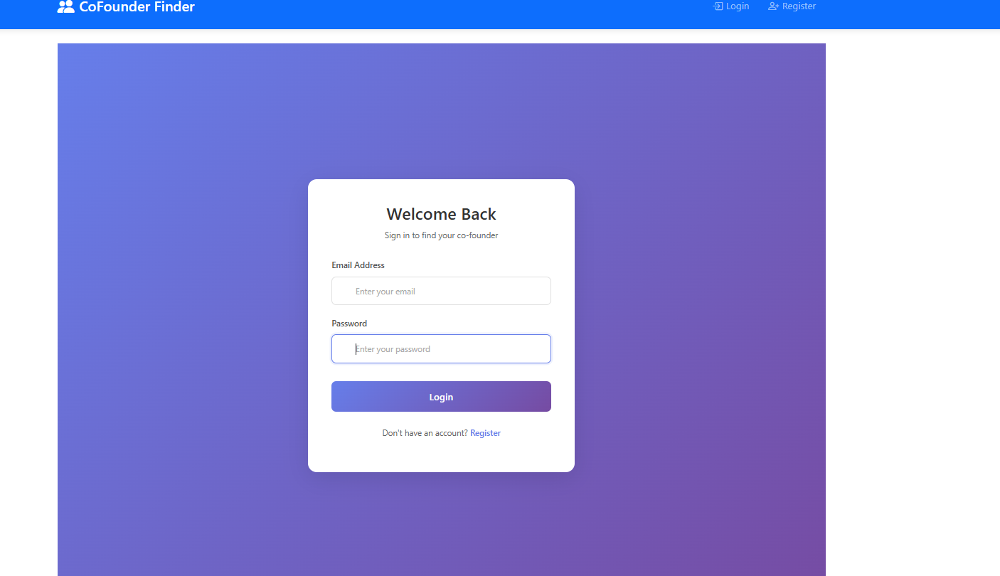
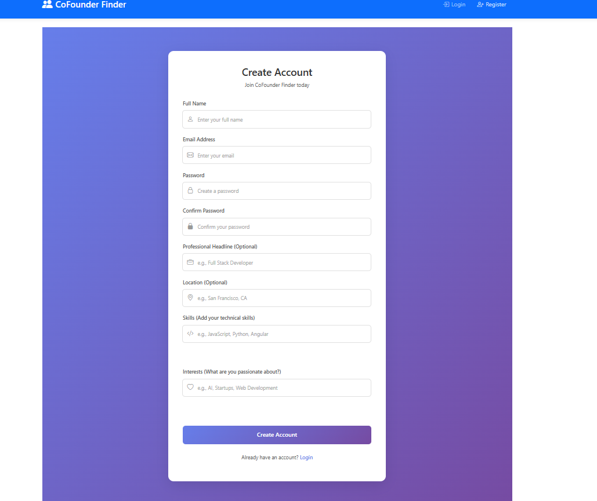
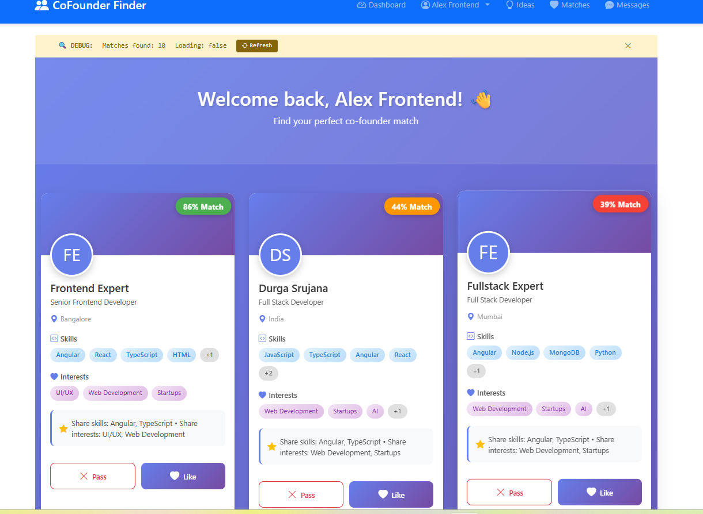
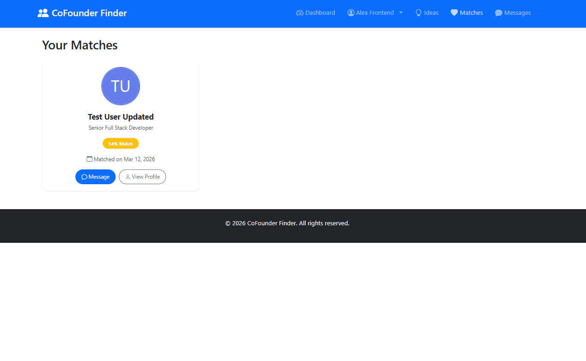
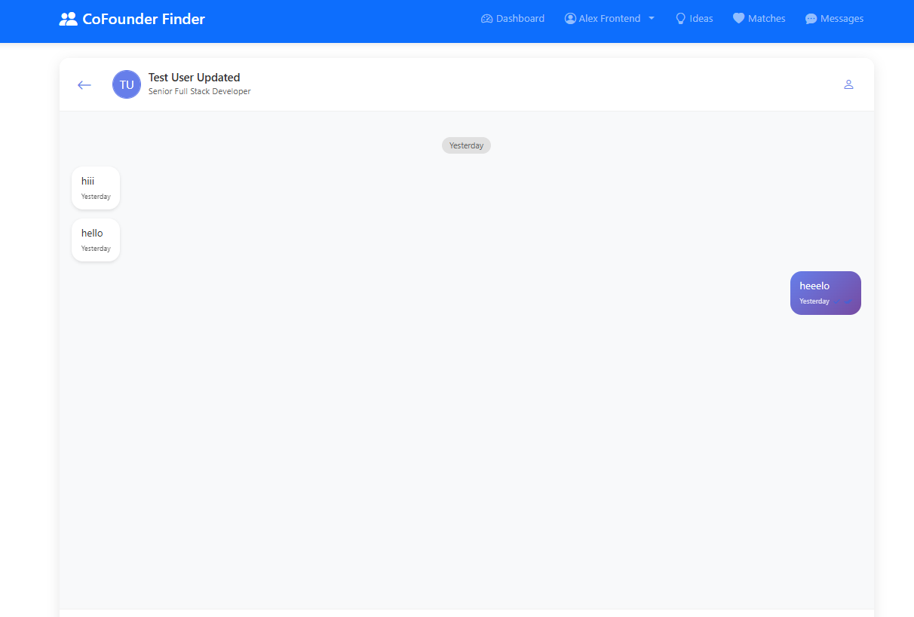
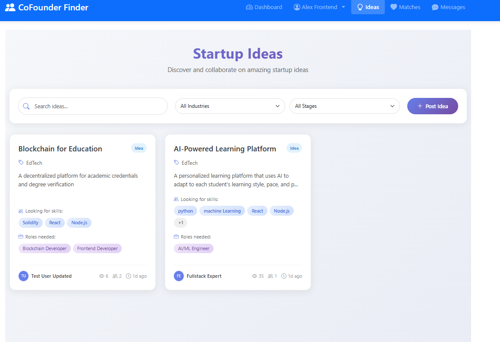

🚀 VentureMatch – Co-Founder Finder Platform
1️⃣ Project Title

VentureMatch is a platform that helps entrepreneurs find startup co-founders based on skills, interests, and startup ideas.

2️⃣ Project Description

VentureMatch is a full-stack web application designed to connect entrepreneurs who want to build startups but need the right partners.

Users can create profiles, discover potential co-founders, collaborate on startup ideas, and communicate through real-time chat.

The project demonstrates modern full-stack development using Angular, ASP.NET Core Web API, and MongoDB.

## Demo / Screenshots

### 🔐 Login Page

### 📝 Signup Page

### 📊 Dashboard

### 🤝 Co-Founder Matching

### 💬 Messages / Chat

### 💡 Startup Ideas

4️⃣ Features

✔ User registration and login
✔ Secure authentication using JWT
✔ User profile creation and management
✔ Co-founder discovery system
✔ Like / pass potential co-founders
✔ Mutual match detection
✔ Real-time messaging using SignalR
✔ Startup idea posting and collaboration
✔ Apply to join startup teams

5️⃣ Tech Stack
Frontend

Angular

TypeScript

Bootstrap

RxJS

Backend

ASP.NET Core Web API

.NET

MongoDB Atlas

Tools

JWT Authentication

SignalR

Swagger

6️⃣ Project Structure
VentureMatch
│
├── backend
│   ├── Controllers
│   ├── Models
│   ├── DTOs
│   ├── Services
│   ├── Data
│   └── Program.cs
│
├── frontend
│   ├── src
│   │   ├── app
│   │   ├── assets
│   │   └── environments
│   └── package.json
│
├── screenshots
│   ├── login.png
│   ├── dashboard.png
│   ├── matching.png
│   ├── chat.png
│   └── ideas.png
│
└── README.md
7️⃣ Installation

Clone the repository

git clone https://github.com/yourusername/VentureMatch.git
cd VentureMatch
8️⃣ Run the Project
Backend
cd backend
dotnet restore
dotnet run

Backend runs at:

http://localhost:5000

Swagger API documentation:

http://localhost:5000/swagger
Frontend
cd frontend
npm install
ng serve

Frontend runs at:

http://localhost:4200
9️⃣ Future Improvements

AI-based co-founder recommendations

Email notifications

Push notifications

Mobile application version

Team collaboration features

🔟 Author

Durga Srujana

GitHub
https://github.com/DurgaSrujana57